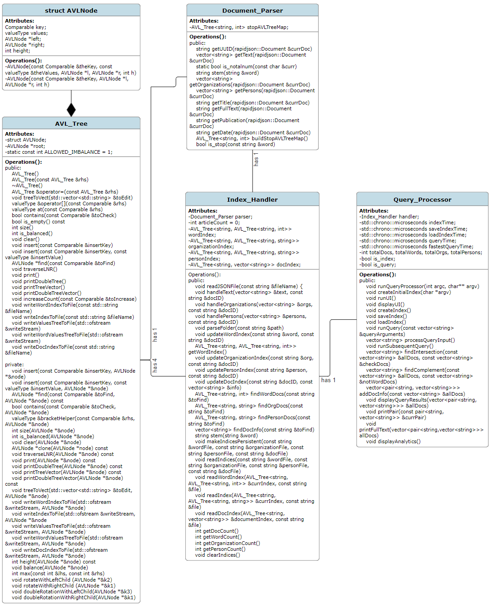

# Assignment 4: Answers

**Complete this document, commit your changes to Github and submit the repository URL to Canvas.** Keep your answers short and precise.

Names of all team members:
Logan Hight

Used free extension: [ ] 24 hrs or [ ] 48 hrs

[x] Early submission (48 hrs)

[x] Bonus work. Describe: Display full text from a query result, automatic timing and parsing increment display, output search engine analytics, error handling (see Bonus Work section)

Place [x] for what applies.

## Answers

### Project Management

Complete the tasks and planned completion columns **BEFORE** You start with
coding!

Weekly milestones/tasks. Set out a plan at the beginning and then record when you got it done.

| Task        | Planned completion | Actual completion | Estimated time in hrs | Actual time in hrs |
| ----------- | :-----------------:| :---------------: | :--------------------: | :--------------------: |
| Implement AVL Tree          | Nov 5              | Nov 11             | 4                    | 7                      |
| Initial UML Diagram and Pseudo Code        | Nov 5              | Nov 5             | 2                    | 1                      |
| Implement Document Parser        | Nov 8              | Nov 15             | 20                    | 12                      |
| Build Indices         | Nov 8              | Nov 17             | 10                    | 4                      |
| Implement Query Parser          | Nov 15              | Nov 18             | 20                    | 15                      |
| Implement User Interface         | Nov 15              | Nov 18             | 2                    | 3                      |
| Implement Persistence for Indices        | Nov 15              | Nov 20             | 5                    | 7                      |

### High-level Design of Solution

- UML class diagram:


- High-level pseudo code for each component:
  - AVL_Tree
    - Implementation of self-balancing binary search tree. Implements all basic BST tree funcitons, as well as balancing and
    rotations (see UML Class Diagram)
    - Also implements other functionality specifc for search engine use (see UML Class Diagram)
  - Document_Parser:
    - Given a JSON document wrapper, gets all required information from the document:
      - ID, text as individual words, organizations, persons, title, full text, publication, date of publication
    - Also responsible for stemming words and eliminating stops words
    - Uses RapidJSON parsing and Porter2 stemming algorithm
  - Index_Handler:
    - Contains 1 Document_Parser data member
    - Parses through each JSON document in a file path
    - Extracts all required information
    - Maps all words in the dataset to the document IDs that they appear in - also keeps track of the number of times the word appears in each document
    - Maps all organizations and persons to the document IDs that they appear in
    - Maps all document IDs to their associated info (date, title, publication, full text)
  - Query Processor:
    - Contains 1 Index_Handler data member
    - Allows user to create an index from a file path containing JSON documents
    - Allows user to save the index to specified files
    - Allows user to load an index from specified files
    - Allows user to execute queries and returns the matching documents in order of relevancy
      - Stems query input to match the content of the indices
      - Finds intersection and complement of results of individual query elements as needed
      - Computes relevancy of query results according to most recent publication date
    - Displays several important search engine analytics:
      - Index and query timing, index speed, index sizes

### Used Data Structures

Explanation of what data structures are used where. For each, state - time and space complexity (Big-Oh), - why it is the appropriate data structure and what other data structure could have been used.

   > For parsing the documents, I used strings and vectors to store the required information. The strings have a time and space complexity of O(1), and the vectors have a
   > time and space complexity of O(n), where n is the size of the vectors. I used these data structures because it allowed for simple insertion into the indices and it made it
   > straightforward to iterate through all of the required information from each document.
   > For my indices, I used my self-defined AVL Trees. Each index has a time complexity of O(log n), where n is the number of elements (documents, words, organizations, or persons)
   > in the dataset. Each index has a space complexity of O(n), where n is the number of elements (documents, words, organizations, or persons) in the dataset.
   > Alternatively I could have used a hash table to store the indices.
   > Within the AVL_Tree indices, the main data structure used is strings, which have a time and space complexity of O(1). I used strings because it made it simple to store the information
   > after extracting it from the JSON Document and allowed for ease of query processing. In the document index, I use a vector of strings to store the document information, which has
   > a time and space complexity of O(n). I chose to use this vector because it made it simple to extract all information for a specific document with a single operation. This also made
   > it simple to display all information from each document in the query results. Alternatively, I could have used another internal tree for the document index. However, using a vector
   > of strings as the value for each key in the document index seemed to be the most simple solution. The vectors will never have more than 4 elements, so the O(n) time complexity
   > is not a large concern.
   > For querying, I used vectors to keep track of the query arguments and results. These vectors have a time complexity of O(n), where n is the number of query arguments or results.
   > These vectors also have a space complexity of O(n), where n is the number of query arguments or results.
   > Alternatively, I could have used AVL Trees to store the query results. However, I decided that it would be easier to sort and print the results using the vectors I implemented.
   > I also could have used an array to store query arguments or just left it as a string of multiple words. However, I decided that it would be easiest to iterate through the query arguments
   > and perform the appropriate functionality sequentially if a vector was used to store the query arguments.
   > For all other search engine functionality, I sued strings when getting input from the user. These strings have a time and space complexity of O(1). I chose to use strings as
   > opposed to character arrays because it made it easy to compare strings and get feedback from the user.

### User Documentation

- Search Engine Features:
  - My solution features 4 distinct inverted file indices that are built using AVL Trees:
    - Word Index: maps each word in the dataset to each document they appear in and the number of times they appear in the document
    - Organization Index: maps each organization in the dataset to each document they appear in
    - Person Index: maps each person in the dataset to each document they appear in
    - Document Index: maps each document to its associated info; date, title, publication, full text
  - My solution uses RapidJSON parsing and the Porter2 stemming algorithm to handle the information from the documents
  - My solution allows users to create an index from their desired directory, save this index to 4 distinct files, and load an index from 4 distinct files
  - My solution allows users to execute queries to find matching documents
  - My solution computes the relevancy of user query results according to most recent date of publication and displays query results in order of relevancy
  - My solution outputs all timing statistics for each search engine function (creating an index, saving an index, loading an index, executing a query)
  - My solution implements several error handling techniques to ensure proper use of the search engine
  - My solution implements a unique persistence mechanism to save and load the indices to/from distict .txt files
    - The persistence mechanism utlizes in-order traversal so that that the elements of each index (documents, words, organizations, or persons) appear in alphabetical order
  - My solution eliminates the need for specialized constructors that create the elements of search engine with pointers
    - Through careful planning, I devised a solution that creates a single Query_Processor, Index_Handler, and Document_Parser every time the program is ran
    - The main function creates a Query_Processor, which has an Index_Handler data member, which in turn has a Document_Parser data member
    - This results in a single version of each search engine element being created every time the program is ran
  - My solution does not create any memory leaks, which was verified by running all functions with valgrind
  - My solution tests multiple cases (including edge and error cases) of all functions, including:
    - Unit tests for my AVL_Tree's function using Catch2, tests for my AVL_Tree for memory leaks, including persistence mechanisms, unit tests for my Index_Handler using Catch2, and system tests for performing queries on a smaller dataset which verifies the accuracy of results
    - These tests can be seen in the files; test_AVL_Tree.cpp, test_Index_Handler.cpp, test_Query_Processor.cpp
      - Each test has a corresponding executable
  - My solution includes several bonus features, such as:
    - Allowing users to print the full text of one of their query results
    - Automatically displays the time it takes to execute search engine functionality
    - Automatically displays parsing increments every 25,000 documents when creating an index from a large dataset
    - Maintaining and displaying several important search engine analytics, including:
      - Index and query timing, index speed, index sizes
    - Error handling
- How to use the search engine:
  - Users will initially enter one command line argument, options are:

  ```c++:
  ./supersearch index <directory>
  ```

  - This will parse through all documents in the directory and save the resulting indices to the default files:
    - "WordIndex.txt", "OrganizationIndex.txt", "PersonIndex.txt", "DocumentIndex.txt"

  ```c++:
  ./supersearch query social network PERSON:cramer
  ```

  - This will load the existing index from the default files and execute the query
    - Note: query must be properly formatted (see instructions below)

  ```c++:
  ./supersearch ui
  ```

  - This will start the user interface and allow for continued interaction between the user and the search engine
    - This is the recommended way to use the search engine
  - The user interface gives the user additional actions to perform with the search engine:
    - create new index, save index, load index, execute query, display analytics, or exit
  - If the user elects to create a new index, they must enter the file path for the corpus of the index to be created
  - If the user elects to save the index, they must either elect to use the default file names or specify 4 distinct file names to save the word, organization, person, and document indices to
  - If the user elects to load an index, they must either elect to use the default file names or specify 4 distinct file names to load the word, organization, person, and document indices from
    - Note: loading an index overrides the current index
  - If the user elects to execute a query, they must ensure that it is properly formatted (see instructions below)
    - Users will be shown the total number of results to their query
    - The top 15 results (or all results if there are less than 15) will be displayed in order of relevancy
    - After executing a query, users can select to print the full text of one of their query results if they desire
  - Notes:
    - Using the user interface will not create an index by default
      - So, users must create or load an index before saving the index, executing queries, or displaying analytics
    - Additionally, users must execute at least one query before displaying analytics

#### Query Instructions

- Queries can contain 4 elements: words, organizations, persons, and not words (these words cannot appear in the resulting articles)
  - all words are written normally, ex: "stocks"
  - all organizations must be preceded by ORG:, ex: "ORG:reuters"
  - all persons must be preceded by PERSON:, ex: "PERSON:musk"
  - all not words are preceded by a hyphen, ex: "-facebook"
- The elements of a query can appear in any order, the only exception to this is that the first element of a query cannot be a not word (a word preceded by a hyphen)
- Each query must contain at least 1 word, organization, or person
  - A query cannot consist of only a not word or not words
- Note: in order to match the content of the indices, query words will be stemmed and stop words will be removed from queries:
  - This only affects the word and not word elements of a given query
  - Organizations and persons will be left as they are entered
  - However, a query cannot consist of just a stop word (this is essentially the same as the query consisting of no elements)

- Example queries:
  - stocks
    - This query should return all documents that contain the word stocks
    - Executing this query on the total dataset gives 47215 results, as seen below:

  ```c++:
  Please enter your query: 
  stocks
  It took 44702 microseconds to execute your query.

  Your query returned 47215 results.
  Query Results:
  1. UUID: 4e98d60820f258831e2e5e6d70ab09b30c840030 -- Title: Organovo: Fiscal 4Q Earnings Snapshot -- Publication: cnbc.com -- Date: 2018-06-01T00:30:00.000+03:00
  2. UUID: 646e02dc300b50d59259f8f3a0dfeeab6bdc3f8e -- Title: Workday: Fiscal 1Q Earnings Snapshot -- Publication: cnbc.com -- Date: 2018-06-01T00:20:00.000+03:00
  3. UUID: 044db4d7426dd668921ffd7e167ec76df408dc1d -- Title: Dialog says Apple to source fewer main smartphone power chips from it -- Publication: reuters.com -- Date: 2018-06-01T00:09:00.000+03:00
  4. UUID: 59b0a7f62dc86cec5f2fcef30c33515556b922a4 -- Title: RPT-GLOBAL MARKETS-Trade conflict weighs on stock markets -- Publication: reuters.com -- Date: 2018-05-31T23:48:00.000+03:00
  5. UUID: a75f82e72956d25c9e3e0ce2e5afe98ce6fd28f8 -- Title: UPDATE 1-South African rand falls after disappointing trade data, stocks rise -- Publication: reuters.com -- Date: 2018-05-31T23:43:00.000+03:00
  6. UUID: cd0e79bcecb82f5e2ae1ac4982a84e1c750b68d1 -- Title: RPT-GLOBAL MARKETS-Trade conflict weighs on stock markets -- Publication: reuters.com -- Date: 2018-05-31T23:28:00.000+03:00
  7. UUID: 3a47b04f61888d6999ec56e99eec7b6b2193a955 -- Title: Foreigners sell $1.15 bln of Turkish bonds and stocks May 1-25 -IIF -- Publication: reuters.com -- Date: 2018-05-31T23:20:00.000+03:00
  8. UUID: 700c96d1d86ea33435676d97b6761e6a4c46e568 -- Title: Icahn sells 10.5 million Herbalife shares back to company -- Publication: reuters.com -- Date: 2018-05-31T22:56:00.000+03:00
  9. UUID: 99f1393647a1b86a59d7dff693b68c96ed661707 -- Title: US STOCKS-Wall St slips as U.S. tariffs spark trade war worries -- Publication: reuters.com -- Date: 2018-05-31T22:50:00.000+03:00
  10. UUID: a6a4b5cfd0b76351b19758bf20c190c65f1f30f2 -- Title: UPDATE 6-SoftBank joins GM in self-driving car race; GM shares soar -- Publication: cnbc.com -- Date: 2018-05-31T22:47:00.000+03:00
  11. UUID: 6a25c7ca1f04e667339caab653ee46d288407f4a -- Title: Barclays Africa to join Nigeria's bourse in July - head of markets -- Publication: reuters.com -- Date: 2018-05-31T22:43:00.000+03:00
  12. UUID: a054540ad55be8d45bb175e8bf11d9b46983073b -- Title: UPDATE 1-Canada to impose tariffs on U.S., challenge at WTO -- Publication: reuters.com -- Date: 2018-05-31T22:35:00.000+03:00
  13. UUID: 4fa00434c95cdaf445004a9cc8a362e781355d32 -- Title: Chinese stock addition to indexes will 'change the face' of emerging markets investing on Thursday -- Publication: cnbc.com -- Date: 2018-05-31T22:09:00.000+03:00
  14. UUID: aba4a7ffa153bf99719f2c758c47f5069b5afa4e -- Title: Robbins Arroyo LLP: Fluor Corporation (FLR) Misled Shareholders According to a Recently Filed Class Action -- Publication: cnbc.com -- Date: 2018-05-31T22:05:00.000+03:00
  15. UUID: b694eaa0976e4e7df29164ee51b2d96ad17eb4b6 -- Title: U.S. trade tariffs provide investment opportunities in steel stocks -- Publication: reuters.com -- Date: 2018-05-31T22:01:00.000+03:00
  ```

  - stocks -deficit
    - This query should return all documents that contains the word stocks and does not contain the word deficit
    - Executing this query on the total dataset gives 43761 results, as seen below:

  ```c++:
  Please enter your query: 
  stocks -deficit    
  It took 964130 microseconds to execute your query.

  Your query returned 43761 results.
  Query Results:
  1. UUID: 4e98d60820f258831e2e5e6d70ab09b30c840030 -- Title: Organovo: Fiscal 4Q Earnings Snapshot -- Publication: cnbc.com -- Date: 2018-06-01T00:30:00.000+03:00
  2. UUID: 646e02dc300b50d59259f8f3a0dfeeab6bdc3f8e -- Title: Workday: Fiscal 1Q Earnings Snapshot -- Publication: cnbc.com -- Date: 2018-06-01T00:20:00.000+03:00
  3. UUID: 044db4d7426dd668921ffd7e167ec76df408dc1d -- Title: Dialog says Apple to source fewer main smartphone power chips from it -- Publication: reuters.com -- Date: 2018-06-01T00:09:00.000+03:00
  4. UUID: 59b0a7f62dc86cec5f2fcef30c33515556b922a4 -- Title: RPT-GLOBAL MARKETS-Trade conflict weighs on stock markets -- Publication: reuters.com -- Date: 2018-05-31T23:48:00.000+03:00
  5. UUID: cd0e79bcecb82f5e2ae1ac4982a84e1c750b68d1 -- Title: RPT-GLOBAL MARKETS-Trade conflict weighs on stock markets -- Publication: reuters.com -- Date: 2018-05-31T23:28:00.000+03:00
  6. UUID: 3a47b04f61888d6999ec56e99eec7b6b2193a955 -- Title: Foreigners sell $1.15 bln of Turkish bonds and stocks May 1-25 -IIF -- Publication: reuters.com -- Date: 2018-05-31T23:20:00.000+03:00
  7. UUID: 700c96d1d86ea33435676d97b6761e6a4c46e568 -- Title: Icahn sells 10.5 million Herbalife shares back to company -- Publication: reuters.com -- Date: 2018-05-31T22:56:00.000+03:00
  8. UUID: 99f1393647a1b86a59d7dff693b68c96ed661707 -- Title: US STOCKS-Wall St slips as U.S. tariffs spark trade war worries -- Publication: reuters.com -- Date: 2018-05-31T22:50:00.000+03:00
  9. UUID: a6a4b5cfd0b76351b19758bf20c190c65f1f30f2 -- Title: UPDATE 6-SoftBank joins GM in self-driving car race; GM shares soar -- Publication: cnbc.com -- Date: 2018-05-31T22:47:00.000+03:00
  10. UUID: 6a25c7ca1f04e667339caab653ee46d288407f4a -- Title: Barclays Africa to join Nigeria's bourse in July - head of markets -- Publication: reuters.com -- Date: 2018-05-31T22:43:00.000+03:00
  11. UUID: a054540ad55be8d45bb175e8bf11d9b46983073b -- Title: UPDATE 1-Canada to impose tariffs on U.S., challenge at WTO -- Publication: reuters.com -- Date: 2018-05-31T22:35:00.000+03:00
  12. UUID: 4fa00434c95cdaf445004a9cc8a362e781355d32 -- Title: Chinese stock addition to indexes will 'change the face' of emerging markets investing on Thursday -- Publication: cnbc.com -- Date: 2018-05-31T22:09:00.000+03:00
  13. UUID: aba4a7ffa153bf99719f2c758c47f5069b5afa4e -- Title: Robbins Arroyo LLP: Fluor Corporation (FLR) Misled Shareholders According to a Recently Filed Class Action -- Publication: cnbc.com -- Date: 2018-05-31T22:05:00.000+03:00
  14. UUID: b694eaa0976e4e7df29164ee51b2d96ad17eb4b6 -- Title: U.S. trade tariffs provide investment opportunities in steel stocks -- Publication: reuters.com -- Date: 2018-05-31T22:01:00.000+03:00
  15. UUID: 25de5ab46ddddfaf763c1491b0b557e37044af0d -- Title: U.S. trade tariffs provide investment opportunities in steel stocks -- Publication: reuters.com -- Date: 2018-05-31T22:01:00.000+03:00
  ```

  - tax stocks ORG:reuters -italy
    - This query should return all documents that contain the words tax and stocks, and do not contain the word italy
    - Executing this query on the total dataset gives 11255 results, as seen below:

  ```c++:
  Please enter your query: 
  tax stocks ORG:reuters -italy
  It took 18934411 microseconds to execute your query.

  Your query returned 11255 results.
  Query Results:
  1. UUID: c7659969ac489f368495d3476795ae54304fa0fe -- Title: Oil price rise hurts consumers, helps sector in U.S.: Fed official -- Publication: reuters.com -- Date: 2018-06-01T02:05:00.000+03:00
  2. UUID: 421bee3c35069a0650f6fa085eeff9279d4a4c0f -- Title: Oil price rise hurts consumers, helps sector in U.S. -Fed official -- Publication: reuters.com -- Date: 2018-06-01T01:58:00.000+03:00
  3. UUID: 28afe72f59c87d66c05af89232a668a98a10d5b2 -- Title: Trump tariffs hitting 'wrong target': leading U.S. House Republican -- Publication: reuters.com -- Date: 2018-06-01T01:01:00.000+03:00
  4. UUID: d0cc765402dec375da2b826ed3eac401cbf9e29c -- Title: UPDATE 1-Uzbekistan to buy out GM stake in car factory - report -- Publication: reuters.com -- Date: 2018-05-31T23:38:00.000+03:00
  5. UUID: 910c589ab3db805b3ab305ad5649210fd8707302 -- Title: Illinois House vote sends FY 2019 budget to governor -- Publication: reuters.com -- Date: 2018-05-31T21:27:00.000+03:00
  6. UUID: e7d750cb52c186e80ee86eb549fb1afa5bd5348d -- Title: RPT-POLL-Wall Street set to resume gains, rise 6 pct from here -- Publication: cnbc.com -- Date: 2018-05-31T20:54:00.000+03:00
  7. UUID: 3100ff5a423a543ece932c71325f989ffb11c86d -- Title: Uganda imposes tax on social media use -- Publication: reuters.com -- Date: 2018-05-31T20:34:00.000+03:00
  8. UUID: b2afdac64d586a2b5c49c58a9dd624af70b7e678 -- Title: Matt Le Blanc to step down as BBC 'Top Gear' host -- Publication: reuters.com -- Date: 2018-05-31T20:25:00.000+03:00
  9. UUID: a56d06bf3649994d4ef253abccaad8f70e583c20 -- Title: Uganda imposes tax on social media use -- Publication: reuters.com -- Date: 2018-05-31T20:23:00.000+03:00
  10. UUID: 6bb68b1af9476f188334203196b6ebf281aaf1ab -- Title: Matt Le Blanc to step down as BBC 'Top Gear' host -- Publication: reuters.com -- Date: 2018-05-31T20:18:00.000+03:00
  11. UUID: 31056054e87dea59324d43980262c36f1c747c4e -- Title: Matt Le Blanc to step down as BBC 'Top Gear' host -- Publication: reuters.com -- Date: 2018-05-31T20:16:00.000+03:00
  12. UUID: e58cd9945f4b86cef4571fdf268a6f812f157bb0 -- Title: Uganda imposes tax on social media use -- Publication: reuters.com -- Date: 2018-05-31T20:09:00.000+03:00
  13. UUID: 3064523557d4acc21627fb43aea843d48fa8e698 -- Title: Wall Street set to resume gains, rise 6 percent from here: Reuters poll -- Publication: reuters.com -- Date: 2018-05-31T19:59:00.000+03:00
  14. UUID: c59f44e9491ddce646643b717bbef0f36397609b -- Title: Dollar Tree, Dollar General same-store sales disappoint, shares fall -- Publication: reuters.com -- Date: 2018-05-31T19:14:00.000+03:00
  15. UUID: f768d2e0b280c69c0d91ffa2803b8fa71fd8a9d1 -- Title: U.N. warns of 'critical gap' in Syrian refugee aid this year -- Publication: reuters.com -- Date: 2018-05-31T18:00:00.000+03:00
  ```

  - tax stocks ORG:reuters PERSON:zuckerberg
    - This query should return all documents that contain the words tax and stocks, have reuters as an organization entity, and have zuckerberg as a person entity
    - Executing this query on the total dataset gives 6 results, as seen below:

  ```c++:
  Please enter your query: 
  tax stocks ORG:reuters PERSON:zuckerberg
  It took 28084861 microseconds to execute your query.

  Your query returned 6 results.
  Query Results:
  1. UUID: 7a7fad9262560f9576e6c25ab0ccda2bce49d278 -- Title: Highlights: Facebook's Zuckerberg faces EU Parliament grilling -- Publication: reuters.com -- Date: 2018-05-23T00:33:00.000+03:00
  2. UUID: fc3d16e0c403d1ca4b818f56a867cf1aae030b2d -- Title: UPDATE 1-FranceGÇÖs Macron to hold "tough talks" with Facebook's Zuckerberg -- Publication: cnbc.com -- Date: 2018-05-16T19:20:00.000+03:00
  3. UUID: cdf986494183d95fa55e38bd52f6e5a82dc4d686 -- Title: France’s Macron to hold 'tough talks' with Facebook's Zuckerberg -- Publication: reuters.com -- Date: 2018-05-16T18:35:00.000+03:00
  4. UUID: 18b8f62a5c5a756e06b8576c2ec1fc51e17cc645 -- Title: France’s Macron to hold 'tough talks' with Facebook's Zuckerberg -- Publication: reuters.com -- Date: 2018-05-16T18:35:00.000+03:00
  5. UUID: acd28b83d0629f1ad845e18fcf58cc7f24490dcd -- Title: UPDATE 1-France’s Macron to hold "tough talks" with Facebook's Zuckerberg -- Publication: reuters.com -- Date: 2018-05-16T18:20:00.000+03:00
  6. UUID: 20b372c9c554e4e8f514df42cbf9f69debd53de4 -- Title: Wednesday Morning Briefing -- Publication: reuters.com -- Date: 2018-04-11T19:58:00.000+03:00
  ```

  - tax stocks ORG:reuters -italy -argentina -deficit
    - This query should return all documents that contain the words tax and stocks, have reuters as an organization entity, and do not contain the words italy, argenitna, or deficit
    - Executing this query on the total dataset gives 10420 results, as seen below:

  ```c++:
  Please enter your query: 
  tax stocks ORG:reuters -italy -argentina -deficit
  It took 24305686 microseconds to execute your query.

  Your query returned 10420 results.
  Query Results:
  1. UUID: c7659969ac489f368495d3476795ae54304fa0fe -- Title: Oil price rise hurts consumers, helps sector in U.S.: Fed official -- Publication: reuters.com -- Date: 2018-06-01T02:05:00.000+03:00
  2. UUID: 421bee3c35069a0650f6fa085eeff9279d4a4c0f -- Title: Oil price rise hurts consumers, helps sector in U.S. -Fed official -- Publication: reuters.com -- Date: 2018-06-01T01:58:00.000+03:00
  3. UUID: 28afe72f59c87d66c05af89232a668a98a10d5b2 -- Title: Trump tariffs hitting 'wrong target': leading U.S. House Republican -- Publication: reuters.com -- Date: 2018-06-01T01:01:00.000+03:00
  4. UUID: d0cc765402dec375da2b826ed3eac401cbf9e29c -- Title: UPDATE 1-Uzbekistan to buy out GM stake in car factory - report -- Publication: reuters.com -- Date: 2018-05-31T23:38:00.000+03:00
  5. UUID: 910c589ab3db805b3ab305ad5649210fd8707302 -- Title: Illinois House vote sends FY 2019 budget to governor -- Publication: reuters.com -- Date: 2018-05-31T21:27:00.000+03:00
  6. UUID: e7d750cb52c186e80ee86eb549fb1afa5bd5348d -- Title: RPT-POLL-Wall Street set to resume gains, rise 6 pct from here -- Publication: cnbc.com -- Date: 2018-05-31T20:54:00.000+03:00
  7. UUID: 3100ff5a423a543ece932c71325f989ffb11c86d -- Title: Uganda imposes tax on social media use -- Publication: reuters.com -- Date: 2018-05-31T20:34:00.000+03:00
  8. UUID: b2afdac64d586a2b5c49c58a9dd624af70b7e678 -- Title: Matt Le Blanc to step down as BBC 'Top Gear' host -- Publication: reuters.com -- Date: 2018-05-31T20:25:00.000+03:00
  9. UUID: a56d06bf3649994d4ef253abccaad8f70e583c20 -- Title: Uganda imposes tax on social media use -- Publication: reuters.com -- Date: 2018-05-31T20:23:00.000+03:00
  10. UUID: 6bb68b1af9476f188334203196b6ebf281aaf1ab -- Title: Matt Le Blanc to step down as BBC 'Top Gear' host -- Publication: reuters.com -- Date: 2018-05-31T20:18:00.000+03:00
  11. UUID: 31056054e87dea59324d43980262c36f1c747c4e -- Title: Matt Le Blanc to step down as BBC 'Top Gear' host -- Publication: reuters.com -- Date: 2018-05-31T20:16:00.000+03:00
  12. UUID: e58cd9945f4b86cef4571fdf268a6f812f157bb0 -- Title: Uganda imposes tax on social media use -- Publication: reuters.com -- Date: 2018-05-31T20:09:00.000+03:00
  13. UUID: 3064523557d4acc21627fb43aea843d48fa8e698 -- Title: Wall Street set to resume gains, rise 6 percent from here: Reuters poll -- Publication: reuters.com -- Date: 2018-05-31T19:59:00.000+03:00
  14. UUID: c59f44e9491ddce646643b717bbef0f36397609b -- Title: Dollar Tree, Dollar General same-store sales disappoint, shares fall -- Publication: reuters.com -- Date: 2018-05-31T19:14:00.000+03:00
  15. UUID: f768d2e0b280c69c0d91ffa2803b8fa71fd8a9d1 -- Title: U.N. warns of 'critical gap' in Syrian refugee aid this year -- Publication: reuters.com -- Date: 2018-05-31T18:00:00.000+03:00
  ```

### Performance

- Statistics for indexing all documents:
  - Indexing time for total dataset: 342486161 microseconds (342 seconds, 5.7 minutes)
  - Average indexing speed: 894 documents per second
  - Fastest query time out of all executed: 27083 microseconds
  - Total number of documents: 306242 documents
  - Total number of words: 428736 words
  - Total number of organizations: 189619 organizations
  - Total number of persons: 141761 persons

### Bonus Work

Did you attempt any bonuses? If so, please give a brief description of what you did.

   > Yes, I did attempt bonuses. The first bonus I completed is that, after executing a query, users can elect to have the full text of one of their query results displayed. I did this by keeping track of the full text of each document in the document index. After executing a query, if users elect to display the full text of one of their query results, they must type the number that appears next to it when the results are displayed. This number also corresponds to its relevancy ranking among all query results. The next bonus I completed is the display of search engine analytics. This can only be done while using the search engine user interface after an index has been created and at least 1 query has been executed. If the user gives the "analytics" command, information regarding indexing and query time, indexing speed, index size, etc. will be displayed. I keep track of these analytics by updating them every time an index was created and a query was executed. Another bonus I completed is that the search engine automatically displays timing statistics when performing search engine functionality and displays parsion increments every 25,000 documents when creating an index. The final bonus I completed was error handling. This error handling is specific to input from the user while using the search engine. These error handling techniques ensure proper use of the search engine. I did this by checking user input and ensuring that it was a valid option or command. I also keep track of 2 boolean variable (is_index and is_query) that corresponded to whether an index is created and at least 1 query has been executed. The value of these variables is checked before executing functions that require an index or a query (such as save an index, execute a query, display analytics)

### External Sources

- [Total Dataset](https://www.kaggle.com/datasets/jeet2016/us-financial-news-articles)
- [RapidJSON Parser](https://rapidjson.org/)
- [Porter2 Stemming Algorithm](https://bitbucket.org/smassung/porter2_stemmer/src)
- [List of Stop Words](http://www.webconfs.com/stop-words.php)

### Contributors

- **Logan Hight**
